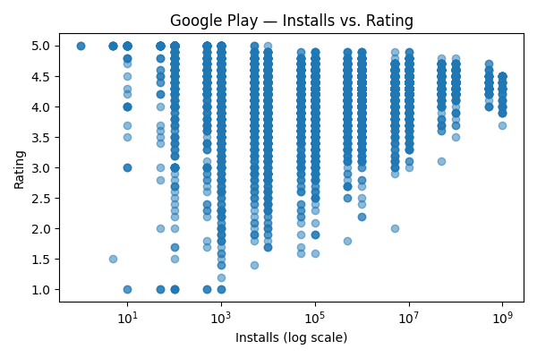
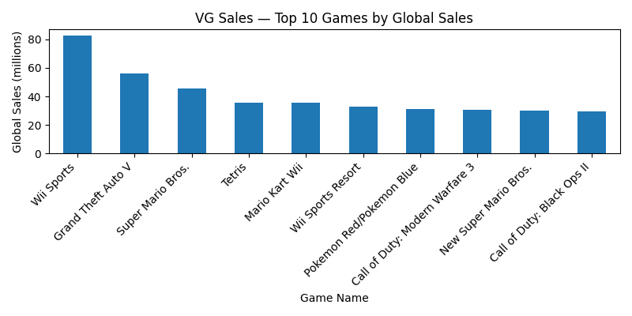
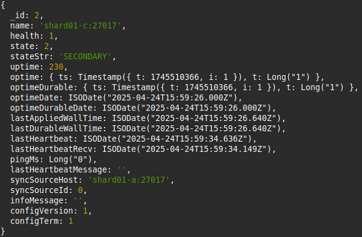
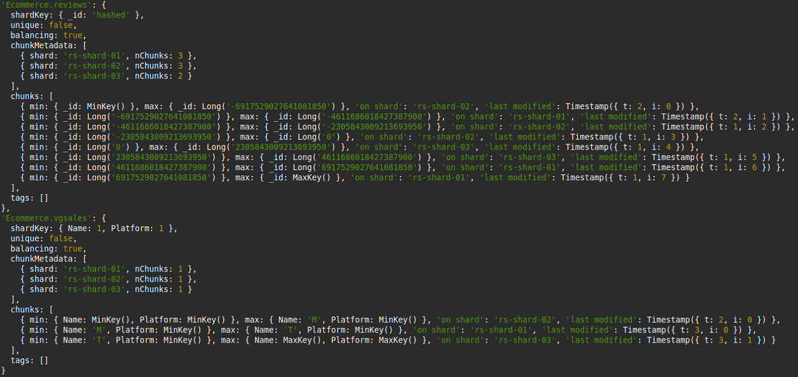

# BSQBD-MongoDB: Distribuovaný databázový systém pro analýzu více datových sad

<p align="center">
  <a href="README.md"></a>
  <a href="README.cs.md"></a>
  <a href="README.ua.md"></a>
  <a href="README.ru.md"></a>
</p>

Tento projekt demonstruje sofistikované, shardované prostředí clusteru MongoDB vytvořené pomocí Docker Compose. Je navržen pro zpracování a analýzu více velkých datových sad a představuje pokročilé funkce MongoDB, jako je sharding, replikační sady, komplexní agregační pipeline, strategie indexování a zabezpečení.

---

## 📖 Obsah
- [Přehled projektu](#-přehled-projektu)
- [Funkce](#-funkce)
- [Technologický stack](#️-technologický-stack)
- [Architektura systému](#️-architektura-systému)
  - [Komponenty clusteru](#komponenty-clusteru)
  - [CAP teorém a naše konfigurace](#cap-teorém-a-naše-konfigurace)
  - [Strategie shardingu](#strategie-shardingu)
  - [Perzistence a replikace dat](#perzistence-a-replikace-dat)
  - [Diagram architektury](#diagram-architektury)
- [Datové sady](#️-datové-sady)
  - [Podrobnosti a schéma datových sad](#podrobnosti-a-schéma-datových-sad)
- [Analýza a vizualizace dat](#-analýza-a-vizualizace-dat)
- [Začínáme](#-začínáme)
  - [Předpoklady](#předpoklady)
  - [Instalace a nastavení](#instalace-a-nastavení)
- [Použití](#-použití)
  - [Připojení ke clusteru](#připojení-ke-clusteru)
  - [Průběh inicializace clusteru](#průběh-inicializace-clusteru)
- [Ověření clusteru](#-ověření-clusteru)
- [Ukázka pokročilých dotazů MongoDB](#-ukázka-pokročilých-dotazů-mongodb)
- [Struktura projektu](#-struktura-projektu)
- [Přispívání](#-přispívání)
- [Licence](#-licence)
- [Poděkování](#-poděkování)

---

## 🚀 Přehled projektu

Hlavním cílem tohoto projektu je navrhnout a implementovat distribuovaný databázový systém založený na **MongoDB 6.0.2**. Cílem je prakticky demonstrovat základní principy distribuované databáze, konkrétně se zaměřením na efektivní ukládání a správu velkých datových sad pomocí **shardingu** a **replikace**. Celé řešení je kontejnerizováno pomocí **Dockeru**, což umožňuje snadné nasazení a automatizovanou konfiguraci.

Tento projekt poskytuje hluboký vhled do architektury clusteru MongoDB, včetně shardů, konfiguračních serverů a routerů. Zahrnuje automatizované skripty pro nasazení, správu rolí uživatelů a autentizaci. Dále představuje praktické zpracování dat se třemi různými datovými sadami: produkty Amazon, aplikace z Google Play Store a prodeje videoher, a ilustruje operace CRUD, agregace a optimalizační techniky.

*Poznámka: Testy výkonu a přímé srovnání s jinými relačními nebo NoSQL databázemi jsou mimo rozsah této verze.*

## ✨ Funkce

- **Shardovaný cluster:** Data jsou distribuována mezi tři samostatné shardy, z nichž každý je konfigurován jako 3členná replikační sada pro vysokou dostupnost a odolnost proti chybám.
- **Automatizované nasazení:** Plně kontejnerizované nastavení pomocí Dockeru a Docker Compose pro nasazení a zrušení jedním příkazem.
- **Zabezpečení:** Cluster je zabezpečen pomocí autentizace pomocí souboru s klíčem (keyfile), což zajišťuje, že v rámci clusteru mohou komunikovat pouze ověření členové.
- **Validace dat:** Na všech kolekcích je vynucena přísná validace schématu JSON, aby byla od začátku zachována integrita dat.
- **Pokročilé dotazování:** Komplexní sada dotazů demonstruje složité operace pro analytiku, indexování a správu clusteru.
- **Automatizovaná inicializace:** Skripty se starají o celý proces nastavení: inicializaci replikačních sad, konfiguraci routeru, vytváření uživatelů, definování strategií shardingu a import všech datových sad.
- **Připraveno pro analýzu dat:** Zahrnuje skript v Pythonu (`analyse_data.py`) pro provádění analýzy dat a generování vizualizací přímo z databáze.

---

## 🛠️ Technologický stack

Projekt je postaven na následujících technologiích:


---

## 🏗️ Architektura systému

Celá infrastruktura je definována v souboru `docker-compose.yml` a skládá se z několika propojených služeb běžících v samostatných kontejnerech.

### Komponenty clusteru

| Služba                  | Počet | Popis                                                                                                   |
| ----------------------- | :---: | ------------------------------------------------------------------------------------------------------- |
| **Router (mongos)**     |   1   | Funguje jako směrovač dotazů a poskytuje jediný vstupní bod pro klientské aplikace do shardovaného clusteru. |
| **Konfigurační servery**|   3   | 3členná replikační sada (`rs-config-server`), která ukládá metadata clusteru a konfiguraci shardingu.      |
| **Shard 1**             |   3   | 3členná replikační sada (`rs-shard-01`) ukládající podmnožinu dat. Označeno pro datový rozsah `A-M`.       |
| **Shard 2**             |   3   | 3členná replikační sada (`rs-shard-02`) ukládající podmnožinu dat. Označeno pro datový rozsah `N-S`.       |
| **Shard 3**             |   3   | 3členná replikační sada (`rs-shard-03`) ukládající podmnožinu dat. Označeno pro datový rozsah `T-Z`.       |
| **Inicializační kontejnery** |   2   | Dočasné kontejnery (`init-cluster`, `init-data`), které spouštějí skripty pro inicializaci clusteru a import dat. |
| **CLI**                 |   1   | Pomocný kontejner s `mongosh` pro přímou interakci s databází.                                           |

### CAP teorém a naše konfigurace

V distribuovaných systémech **CAP teorém** říká, že je nemožné, aby distribuované úložiště dat současně poskytovalo více než dvě z následujících tří záruk: **K**onzistence, **D**ostupnost a **O**dolnost proti rozdělení sítě.

Náš cluster MongoDB je nakonfigurován tak, aby upřednostňoval **Konzistenci (C)** a **Odolnost proti rozdělení sítě (P)**, což z něj činí **CP systém**.
- **Konzistence:** Každé čtení obdrží nejnovější zápis nebo chybu. V našich replikačních sadách jsou zápisy potvrzeny na primárním uzlu, než jsou považovány za úspěšné, což zajišťuje, že všichni klienti vidí stejná data.
- **Odolnost proti rozdělení sítě:** Systém pokračuje v provozu i přes síťová rozdělení (tj. ztrátu zpráv mezi uzly). Naše architektura s replikačními sadami dokáže tolerovat selhání některých uzlů.
- **Dostupnost:** Ačkoli se MongoDB snaží o vysokou dostupnost, v případě síťového rozdělení může obětovat dostupnost, aby zajistila konzistenci. Například pokud primární uzel nemůže komunikovat s většinou své replikační sady, přejde do stavu sekundárního uzlu, čímž se tato část databáze stane nedostupnou pro zápisy, dokud není zvolen nový primární uzel. Tím se předchází scénářům "split-brain" a zaručuje se konzistence dat.

Tato konfigurace byla zvolena pro zajištění spolehlivých čtení a zápisů a pro automatické zvládání selhání uzlů bez zásahu uživatele, což je klíčové pro aplikace náročné na data.

### Strategie shardingu

Projekt využívá hybridní strategii shardingu k optimalizaci distribuce dat na základě charakteristik kolekcí:

- **Hashed Sharding:** Používá se pro kolekce `amazon`, `googleplaystore`, `reviews` a `apps_meta` na polích `product_id` nebo `_id`. Tato strategie zajišťuje rovnoměrnou, náhodnou distribuci dat napříč všemi shardy, což je ideální pro zátěže s velkým objemem zápisů a pro zamezení "hotspotů".
- **Ranged Sharding s Tag-Aware Sharding:** Používá se pro kolekci `vgsales` na základě složeného klíče (`Name`, `Platform`). To je kombinováno s **Tagy** pro připnutí dat na konkrétní shardy na základě abecedních rozsahů názvu hry `Name`. Jedná se o výkonnou funkci pro lokalitu dat, která zajišťuje, že dotazy na hry začínající na 'A'-'M' jsou směrovány přímo na `rs-shard-01`.
    - **Shard `rs-shard-01`**: Tag `A-M`
    - **Shard `rs-shard-02`**: Tag `N-S`
    - **Shard `rs-shard-03`**: Tag `T-Z`

### Perzistence a replikace dat

- **Perzistence:** Data jsou trvale uložena na disku pomocí výchozího úložného enginu MongoDB, WiredTiger. V našem nastavení Dockeru používá každá instance MongoDB (uzly shardu, uzly konfiguračního serveru) dedikovaný Docker **volume**. To zajišťuje, že všechna data a konfigurace přetrvají, i když jsou kontejnery zastaveny nebo restartovány.
- **Využití paměti:** MongoDB aktivně využívá RAM k uložení "pracovní sady" dat a indexů. To umožňuje vysokorychlostní datové operace minimalizací I/O operací na disku. Data se načítají do RAM podle potřeby dotazů.
- **Replikace:** Každý shard je 3členná replikační sada (1 primární, 2 sekundární). To poskytuje:
    - **Vysoká dostupnost a odolnost proti chybám:** Pokud primární uzel selže, automaticky se konají volby a jeden ze sekundárních uzlů je povýšen na primární. Toto "automatické převzetí služeb při selhání" zajišťuje, že cluster zůstane funkční.
    - **Redundance dat:** Data jsou replikována na více uzlů, což chrání před ztrátou dat v případě selhání jednoho uzlu.
    - **Škálovatelnost čtení:** Operace čtení mohou být distribuovány na sekundární uzly (pomocí `readPreference=secondaryPreferred`), což vyrovnává zátěž a zlepšuje celkový výkon clusteru.

### Diagram architektury

Tento diagram ilustruje vysokoúrovňovou architekturu shardovaného clusteru.

<p align="center">
  
</p>

---

## 🗂️ Datové sady

Projekt využívá čtyři veřejné datové sady z Kaggle. Pátá kolekce (`apps_meta`) je generována spojením dvou původních datových sad, aby se využil model vnořených dokumentů MongoDB.

### Podrobnosti a schéma datových sad

- **`amazon.csv`**: Obsahuje informace o produktech z Amazonu.
  - **Popis:** Tato datová sada obsahuje podrobnosti o produktech, jako je jejich název, kategorie, původní cena, zlevněná cena, procento slevy a hodnocení uživatelů.
  - **Schéma:** Vynucuje pole jako `product_id`, `product_name`, `category`, ceny a číselná omezení na `rating` a `discount_percentage`.

- **`googleplaystore.csv`**: Podrobnosti o více než 10 000 aplikacích v Google Play Store.
  - **Popis:** Poskytuje informace o každé aplikaci, včetně její kategorie, hodnocení, velikosti, počtu instalací, typu (zdarma/placené) a ceny.
  - **Schéma:** Vyžaduje pole jako `App`, `Category`, `Reviews`, `Installs` a `Type`, s validací pro hodnoty hodnocení a cenu.

- **`googleplaystore_user_reviews.csv`**: Více než 64 000 uživatelských recenzí aplikací.
  - **Popis:** Obsahuje uživatelsky zadané recenze, včetně textu recenze a předem vypočítaných skóre sentimentu (polarita a subjektivita).
  - **Schéma:** Validuje pole jako `App`, `Translated_Review` a `Sentiment`, přičemž zajišťuje, že polarita je mezi -1 a 1.

- **`vgsales.csv`**: Data o prodeji videoher pro více než 16 500 her.
  - **Popis:** Zahrnuje pořadí, název, platformu, rok vydání, žánr, vydavatele a údaje o prodeji pro Severní Ameriku, Evropu, Japonsko a další regiony, stejně jako celosvětové prodeje.
  - **Schéma:** Vynucuje číselné typy pro prodeje a rok a vyžaduje klíčová pole jako `Name`, `Platform` a `Genre`.

- **`apps_meta` (Generováno)**: Tato kolekce je vytvořena spojením `googleplaystore` a `reviews` pomocí agregace `$lookup`. Každý dokument představuje aplikaci a obsahuje vnořené pole všech jejích uživatelských recenzí, což je ideální pro dotazy, které analyzují aplikace a jejich recenze společně.

---

## 📊 Analýza a vizualizace dat

Skript `Data/analyse_data.py` se připojuje ke clusteru MongoDB, aby provedl analýzu a vygeneroval níže uvedené grafy. Zde jsou některé klíčové vizualizace z analýzy, seskupené podle datové sady.

### Analýza Google Play Store
<table>
  <tr>
    <td align="center"><strong>Top 10 kategorií podle počtu aplikací</strong></td>
    <td align="center"><strong>Instalace vs. Hodnocení</strong></td>
  </tr>
  <tr>
    <td></td>
    <td></td>
  </tr>
</table>

### Analýza prodeje videoher
<table>
  <tr>
    <td align="center"><strong>Top 10 her podle celosvětových prodejů</strong></td>
    <td align="center"><strong>Celkové celosvětové prodeje podle roku</strong></td>
  </tr>
  <tr>
    <td></td>
    <td></td>
  </tr>
</table>

### Analýza produktů Amazon
<table>
  <tr>
    <td align="center"><strong>Top 10 kategorií podle průměrného hodnocení</strong></td>
    <td align="center"><strong>Distribuce procenta slevy</strong></td>
  </tr>
  <tr>
    <td></td>
    <td></td>
  </tr>
</table>

---

## 🚀 Začínáme

Postupujte podle těchto pokynů, abyste zprovoznili cluster MongoDB na svém lokálním počítači.

### Předpoklady

- [Docker](https://www.docker.com/get-started)
- [Docker Compose](https://docs.docker.com/compose/install/)

### Instalace a nastavení

1.  **Klonujte repozitář** (nebo se ujistěte, že jste v kořenovém adresáři projektu).

2.  **Přejděte do adresáře s funkčním řešením:**
    ```sh
    cd "Funkční řešení"
    ```

3.  **Sestavte a spusťte cluster:**
    ```sh
    docker compose up -d
    ```
    Tento příkaz sestaví a spustí všechny potřebné kontejnery v odděleném režimu. Proces inicializace se spustí automaticky. Docker Compose zajistí spuštění služeb ve správném pořadí.

4.  **Sledujte inicializaci:**
    Můžete sledovat logy inicializačních kontejnerů, abyste viděli postup.
    ```sh
    # Sledování nastavení clusteru (replikační sady, uživatelé, sharding)
    docker logs -f init-cluster

    # Sledování procesu importu dat
    docker logs -f init-data
    ```
    Celý proces může trvat několik minut v závislosti na výkonu vašeho počítače. Jakmile kontejner `init-data` dokončí svou práci, cluster je připraven.

## 💻 Použití

### Připojení ke clusteru

Nejjednodušší způsob interakce s databází je použití poskytované služby `cli`, která je předkonfigurována pro připojení s `readPreference=secondaryPreferred` pro vyrovnání zátěže při čtení.

1.  **Spusťte klienta `mongosh` v dočasném kontejneru:**
    ```sh
    docker compose run --rm cli
    ```
2.  Tento příkaz spustí interaktivní shell `mongosh` připojený k instanci routeru `mongos`. Odtud můžete spouštět jakýkoli příkaz MongoDB. Například pro zobrazení stavu shardingu:
    ```javascript
    sh.status()
    ```
    Nebo pro zobrazení kolekcí v databázi `Ecommerce`:
    ```javascript
    use Ecommerce
    show collections
    ```

### Průběh inicializace clusteru
Skript `init_cluster.sh` řídí celý proces nastavení:
1.  **Inicializuje replikační sady:** Konfiguruje každý shard (`rs-shard-01`, `rs-shard-02`, `rs-shard-03`) a replikační sadu konfiguračního serveru (`rs-config-server`).
2.  **Čeká na uzly:** Používá skript `wait-for-it.sh`, aby se ujistil, že všechny uzly jsou připraveny, než bude pokračovat.
3.  **Konfiguruje router:** Přidá všechny shardy do routeru `mongos`.
4.  **Povoluje sharding:** Povolí sharding na databázi `Ecommerce` a sharduje každou kolekci (`amazon`, `googleplaystore`, `reviews`, `vgsales`) s příslušným klíčem shardingu (Hashed nebo Ranged).
5.  **Aplikuje Tag-Aware Sharding:** Přiřadí tagy shardům a definuje rozsahy pro kolekci `vgsales`, aby zajistil lokalitu dat.
6.  **Importuje data:** Nakonec spustí skript `import_datasets.sh` pro naplnění kolekcí z CSV souborů.

---

## 🔬 Ověření clusteru

Následující snímky obrazovky z provozního stavu clusteru slouží jako důkaz, že strategie replikace a shardingu byly úspěšně implementovány.

<details>
<summary><strong>Stav replikační sady (Příklad: rs-shard-01)</strong></summary>
<p>Výstup <code>rs.status()</code> na replikační sadě <code>rs-shard-01</code> ukazuje jeden <strong>PRIMARY</strong> uzel a dva <strong>SECONDARY</strong> uzly, což potvrzuje, že 3členná replikační sada je v pořádku a funkční. Sekundární uzly se aktivně synchronizují s primárním.</p>
<p align="center">
  <strong>Primární uzel (shard01-a)</strong><br>
  
</p>
<p align="center">
  <strong>Sekundární uzly (shard01-b & shard01-c)</strong><br>
  
  
</p>
</details>

<details>
<summary><strong>Stav shardingu (sh.status())</strong></summary>
<p>Výstup <code>sh.status()</code> potvrzuje, že sharding je povolen pro databázi a kolekce. Ukazuje distribuci datových chunků napříč třemi shardy, což demonstruje jak <strong>Hashed Sharding</strong>, tak <strong>Ranged Sharding</strong>.</p>
<p align="center">
  <strong>Metadata shardingu (Amazon & Google Play Store)</strong><br>
  
</p>
<p align="center">
  <strong>Metadata shardingu (Reviews & VG Sales)</strong><br>
  
</p>
</details>

---

## 💡 Ukázka pokročilých dotazů MongoDB

Tato sekce zdůrazňuje jeden reprezentativní dotaz z každé z pěti hlavních kategorií, aby demonstrovala schopnosti projektu v oblasti zpracování dat.

<details>
<summary><strong>1. Manipulace s daty: Aktualizace s agregační pipeline</strong></summary>

Tento dotaz demonstruje výkonnou funkci, kde je agregační pipeline použita přímo v operaci `updateMany`. Cílí na vysoce hodnocenou elektroniku, zvyšuje jejich cenu o 10 % a podmíněně upravuje zlevněnou cenu na základě stávajícího procenta slevy. Nakonec vypočítá a přidá nové pole `discountIncrease`, které ukazuje nový cenový rozdíl. Tím se vyhnete nutnosti načítat data do aplikace, upravovat je a zapisovat zpět.

```javascript
db.amazon.updateMany(
  { category: /^Electronics\|/, rating: { $gte: 4.0 } },
  [
    { $set: {
        price_before_discount: {
          $round: [{ $multiply: ["$price_before_discount", 1.10] }, 2]
        },
        price_after_discount: {
          $round: [
            { $multiply: [
                "$price_after_discount",
                { $cond: [{ $gte: ["$discount_percentage", 20] }, 1.05, 1.0] }
            ] },
            2
          ]
        }
      }
    },
    { $addFields: {
        discountIncrease: {
          $round: [
            { $subtract: ["$price_before_discount", "$price_after_discount"] },
            2
          ]
        }
      }
    }
  ]
);
```
</details>

<details>
<summary><strong>2. Agregační framework: Výpočet Shannonovy entropie</strong></summary>

Tato komplexní agregační pipeline vypočítává **Shannonovu entropii** pro distribuci sentimentů (Pozitivní/Neutrální/Negativní) pro každou aplikaci. Entropie je míra nepředvídatelnosti nebo informačního obsahu. V tomto kontextu vysoké skóre entropie znamená, že recenze pro aplikaci jsou velmi smíšené a polarizované (např. stejný počet pozitivních, neutrálních a negativních recenzí), zatímco nízké skóre naznačuje silný konsenzus v jednom směru. Jedná se o sofistikovaný analytický dotaz provedený zcela v rámci databáze.

```javascript
db.reviews.aggregate([
  { $group:   { _id:{ app:"$App", sentiment:"$Sentiment" }, count:{ $sum:1 } } },
  { $group:   { _id:"$_id.app",
                counts:{ $push:{ k:"$_id.sentiment", v:"$count" } },
                total:{ $sum:"$count" } } },
  { $addFields:{ distArray:{
                  $map:{ input:"$counts", as:"c",
                         in:{ k:"$$c.k", p:{ $divide:["$$c.v","$total"] } } } }
                } },
  { $unwind:  "$distArray" },
  { $addFields:{ term:{
                  $multiply:[ -1,
                    { $multiply:["$distArray.p",{ $ln:"$distArray.p" }] }
                  ]
                } } },
  { $group:   { _id:"$_id", entropy:{ $sum:"$term" } } },
  { $sort:    { entropy:-1 } },
  { $limit:   5 },
  { $project: { _id:0, app:"$_id", entropy:1 } }
])
```
</details>

<details>
<summary><strong>3. Indexování: Částečný složený index pro optimalizaci</strong></summary>

Tento příklad ukazuje **částečný index**, výkonnou optimalizační techniku. Index `CategoryHighRatingIdx` zahrnuje pouze dokumenty, které mají `rating` 4.5 nebo vyšší. To činí index výrazně menším a efektivnějším pro dotazy, které se specificky zaměřují na vysoce hodnocené produkty. Následný dotaz `find` je poté nucen použít tento specializovaný index pomocí `.hint()`, což vede k mnohem rychlejšímu provedení dotazu, protože MongoDB nemusí prohledávat irelevantní, níže hodnocené položky.

```javascript
// Vytvoření částečného indexu
db.amazon.createIndex(
  { category: 1, rating: -1 },
  {
    name: "CategoryHighRatingIdx",
    partialFilterExpression: { rating: { $gte: 4.5 }, category: { $exists: true } }
  }
);

// Použití částečného indexu
db.amazon.find(
  { rating: { $gte: 4.5 }, category: /^Electronics\|/ },
  { category: 1, rating: 1, product_name: 1, _id: 0 }
).sort({ rating: -1 }).hint("CategoryHighRatingIdx").limit(10);
```
</details>

<details>
<summary><strong>4. Sharding: Konfigurace Tag-Aware Sharding</strong></summary>

Tato sada příkazů demonstruje **Tag-Aware Sharding** (také známé jako "Zóny"). Tato pokročilá funkce shardingu umožňuje připnout specifické rozsahy dat na specifické shardy. Zde označíme každý z našich tří shardů abecedním rozsahem. Poté definujeme odpovídající rozsahy na klíči shardingu kolekce `vgsales` (`Name`). Tato konfigurace zaručuje, že všechny videohry s názvy začínajícími od 'A' do 'M' budou sídlit na `rs-shard-01`, 'N' až 'S' na `rs-shard-02` atd. To je mimořádně užitečné pro lokalitu dat a může optimalizovat výkon dotazů tím, že je směruje na přesný shard, kde se data nacházejí.

```javascript
// 1. Přiřazení tagů shardům
sh.addShardTag("rs-shard-01", "A-M");
sh.addShardTag("rs-shard-02", "N-S");
sh.addShardTag("rs-shard-03", "T-Z");

// 2. Přiřazení rozsahů tagů ke klíči shardingu kolekce
sh.addTagRange(
  "Ecommerce.vgsales",
  { Name: MinKey(), Platform: MinKey() },
  { Name: "M", Platform: MaxKey() },
  "A-M"
);
sh.addTagRange(
  "Ecommerce.vgsales",
  { Name: "N", Platform: MinKey() },
  { Name: "S", Platform: MaxKey() },
  "N-S"
);
sh.addTagRange(
  "Ecommerce.vgsales",
  { Name: "T", Platform: MinKey() },
  { Name: MaxKey(), Platform: MaxKey() },
  "T-Z"
);
```
</details>

<details>
<summary><strong>5. Vnořené dokumenty: Najděte 3 nejdelší recenze pro každou aplikaci</strong></summary>

Tento dotaz pracuje s kolekcí `apps_meta`, která má recenze vnořené jako pole. Ukazuje operátor `$sortArray` (nový v MongoDB 5.2) pro seřazení vnořeného pole `reviews` pro každý dokument na základě délky textu recenze. Po seřazení použije `$slice` k získání pouze 3 nejdelších recenzí. Jedná se o výkonný příklad provádění složitých manipulací s poli přímo v databázi na vnořených dokumentech.

```javascript
db.apps_meta.aggregate([
  { $match: { "reviews.0": { $exists: true } } },
  {
    $addFields: {
      sortedByLength: {
        $sortArray: {
          input: {
            $map: {
              input: "$reviews", as: "r",
              in: { review: "$$r", length: { $strLenCP: "$$r.Translated_Review" } }
            }
          },
          sortBy: { length: -1 }
        }
      }
    }
  },
  {
    $project: {
      _id: 0, appName: 1,
      top3LongestReviews: {
        $map: {
          input: { $slice: ["$sortedByLength", 3] }, as: "item",
          in: "$$item.review"
        }
      }
    }
  }
]);
```
</details>

---

## 📁 Struktura projektu

```
.
├── Data/
│   ├── amazon.csv
│   ├── googleplaystore.csv
│   ├── googleplaystore_user_reviews.csv
│   ├── vgsales.csv
│   └── analyse_data.py
├── Dotazy/
│   └── dotazyMongoDB.txt
└── Funkční řešení/
    ├── docker-compose.yml
    ├── keyfile/
    │   ├── Dockerfile
    │   └── mongodb-keyfile
    └── scripts/
        ├── auth.js
        ├── import_datasets.sh
        ├── init_cluster.sh
        ├── init-configserver.js
        ├── init-router.js
        ├── init-shard01.js
        ├── init-shard02.js
        ├── init-shard03.js
        └── wait-for-it.sh
```

---

## 🤝 Přispívání

Příspěvky jsou to, co dělá open-source komunitu tak úžasným místem pro učení, inspiraci a tvorbu. Jakékoli vaše příspěvky jsou **velmi vítány**.

Pokud máte návrh, který by to mohl vylepšit, prosím, forkujte repozitář a vytvořte pull request. Můžete také jednoduše otevřít issue s tagem "enhancement".

1.  Forkujte projekt
2.  Vytvořte si větev pro novou funkci (`git checkout -b feature/AmazingFeature`)
3.  Potvrďte své změny (`git commit -m 'Add some AmazingFeature'`)
4.  Nahrajte změny do větve (`git push origin feature/AmazingFeature`)
5.  Otevřete Pull Request

---

## 📜 Licence

Distribuováno pod licencí MIT. Více informací naleznete v souboru `LICENSE`.

---

## 🙏 Poděkování

-   Datové sady pocházejí z [Kaggle](https://www.kaggle.com/).
-   Odznaky vytvořeny pomocí [Shields.io](https://shields.io/).
