# MongoDB Sharded Cluster for Data Analysis

This project demonstrates a sophisticated, sharded MongoDB cluster environment built with Docker Compose. It's designed to handle and analyze multiple large datasets, showcasing advanced MongoDB features like sharding, replica sets, complex aggregation pipelines, indexing strategies, and security.

---

## 📖 Table of Contents
- [Project Overview](#-project-overview)
- [Features](#-features)
- [Tech Stack](#-tech-stack)
- [System Architecture](#-system-architecture)
  - [Cluster Components](#cluster-components)
  - [The CAP Theorem and Our Configuration](#the-cap-theorem-and-our-configuration)
  - [Sharding Strategy](#sharding-strategy)
  - [Data Persistence and Replication](#data-persistence-and-replication)
  - [Architectural Diagram](#architectural-diagram)
- [Datasets](#-datasets)
  - [Dataset Details & Schema](#dataset-details--schema)
- [Data Analysis & Visualization](#-data-analysis--visualization)
- [Getting Started](#-getting-started)
  - [Prerequisites](#prerequisites)
  - [Installation & Setup](#installation--setup)
- [Usage](#-usage)
  - [Connecting to the Cluster](#connecting-to-the-cluster)
  - [Cluster Initialization Flow](#cluster-initialization-flow)
- [Advanced MongoDB Queries Showcase](#-advanced-mongodb-queries-showcase)
- [Project Structure](#-project-structure)
- [Contributing](#-contributing)
- [License](#-license)
- [Acknowledgments](#-acknowledgments)

---

## 🚀 Project Overview

The primary goal of this project is to design and implement a distributed database system based on **MongoDB 6.0.2**. It aims to practically demonstrate the core principles of a distributed database, specifically focusing on the efficient storage and management of large datasets through **sharding** and **replication**. The entire solution is containerized using **Docker**, which allows for easy deployment and automated configuration.

This project provides a deep dive into the architecture of a MongoDB cluster, including shards, config servers, and routers. It includes automated scripts for deployment, user role management, and authentication. Furthermore, it showcases practical data handling with three diverse datasets: Amazon products, Google Play Store apps, and video game sales, illustrating CRUD operations, aggregations, and optimization techniques.

*Note: Performance tests and direct comparisons with other relational or NoSQL databases are outside the scope of this version.*

## ✨ Features

- **Sharded Cluster:** Data is distributed across three separate shards, each configured as a 3-member replica set for high availability and fault tolerance.
- **Automated Deployment:** Fully containerized setup using Docker and Docker Compose for one-command deployment and teardown.
- **Security:** The cluster is secured using keyfile authentication, ensuring that only authenticated members can communicate within the cluster.
- **Data Validation:** Strict JSON schema validation is enforced on all collections to maintain data integrity from the start.
- **Advanced Querying:** A comprehensive suite of queries demonstrates complex operations for analytics, indexing, and cluster management.
- **Automated Initialization:** Scripts handle the entire setup process: initializing replica sets, configuring the router, creating users, defining sharding strategies, and importing all datasets.
- **Data Analysis Ready:** Includes a Python script (`analyse_data.py`) for performing data analysis and generating visualizations directly from the database.

---

## 🛠️ Tech Stack

The project is built with the following technologies:


---

## 🏗️ System Architecture

The entire infrastructure is defined in the `docker-compose.yml` file and consists of multiple interconnected services running in separate containers.

### Cluster Components

| Service             | Count | Description                                                                                             |
| ------------------- | :---: | ------------------------------------------------------------------------------------------------------- |
| **Router (mongos)** |   1   | Acts as the query router, providing a single entry point for client applications to the sharded cluster.  |
| **Config Servers**  |   3   | A 3-member replica set (`rs-config-server`) that stores the cluster's metadata and sharding configuration.      |
| **Shard 1**         |   3   | A 3-member replica set (`rs-shard-01`) storing a subset of the data. Tagged for data range `A-M`.                                      |
| **Shard 2**         |   3   | A 3-member replica set (`rs-shard-02`) storing a subset of the data. Tagged for data range `N-S`.                                      |
| **Shard 3**         |   3   | A 3-member replica set (`rs-shard-03`) storing a subset of the data. Tagged for data range `T-Z`.                                      |
| **Init Containers** |   2   | Temporary containers (`init-cluster`, `init-data`) that run scripts to initialize the cluster and import data. |
| **CLI**             |   1   | A utility container with `mongosh` for interacting with the database directly.                            |

### The CAP Theorem and Our Configuration

In distributed systems, the **CAP Theorem** states that it is impossible for a distributed data store to simultaneously provide more than two out of the following three guarantees: **C**onsistency, **A**vailability, and **P**artition Tolerance.

Our MongoDB cluster is configured to prioritize **Consistency (C)** and **Partition Tolerance (P)**, making it a **CP system**.
- **Consistency:** Every read receives the most recent write or an error. In our replica sets, writes are confirmed on the primary before being considered successful, ensuring all clients see the same data.
- **Partition Tolerance:** The system continues to operate despite network partitions (i.e., messages being dropped between nodes). Our architecture, with its replica sets, can tolerate the failure of some nodes.
- **Availability:** While MongoDB aims for high availability, in a network partition scenario, it may sacrifice availability to ensure consistency. For instance, if a primary node cannot communicate with a majority of its replica set, it will step down to a secondary state, making that part of the database unavailable for writes until a new primary is elected. This prevents "split-brain" scenarios and guarantees data consistency.

This configuration was chosen to ensure reliable reads and writes and to automatically handle node failures without user intervention, which is critical for data-intensive applications.

### Sharding Strategy

The project employs a hybrid sharding strategy to optimize data distribution based on collection characteristics:

- **Hashed Sharding:** Used for `amazon`, `googleplaystore`, `reviews`, and `apps_meta` collections on the `product_id` or `_id` fields. This strategy ensures an even, random distribution of data across all shards, which is ideal for write-heavy workloads and to avoid "hotspots".
- **Ranged Sharding with Tag-Aware Sharding:** Used for the `vgsales` collection based on a compound key (`Name`, `Platform`). This is combined with **Tags** to pin data to specific shards based on alphabetic ranges of the game `Name`. This is a powerful feature for data locality, ensuring that queries for games starting with 'A'-'M' are routed directly to `rs-shard-01`, for example.
    - **Shard `rs-shard-01`**: Tag `A-M`
    - **Shard `rs-shard-02`**: Tag `N-S`
    - **Shard `rs-shard-03`**: Tag `T-Z`

### Data Persistence and Replication

- **Persistence:** Data is durably stored on disk using MongoDB's default storage engine, WiredTiger. In our Docker setup, each MongoDB instance (shard nodes, config server nodes) uses a dedicated Docker **volume**. This ensures that all data and configuration persist even if the containers are stopped or restarted.
- **Memory Usage:** MongoDB actively uses RAM to store the "working set" of data and indexes. This allows for high-speed data operations by minimizing disk I/O. Data is loaded into RAM as needed by queries.
- **Replication:** Each shard is a 3-member replica set (1 Primary, 2 Secondaries). This provides:
    - **High Availability & Fault Tolerance:** If the primary node fails, an election is automatically held, and one of the secondaries is promoted to primary. This "automatic failover" ensures the cluster remains operational.
    - **Data Redundancy:** Data is replicated across multiple nodes, protecting against data loss in case of a single-node failure.
    - **Read Scalability:** Read operations can be distributed to secondary nodes (using `readPreference=secondaryPreferred`), balancing the load and improving overall cluster performance.

### Architectural Diagram

This diagram illustrates the high-level architecture of the sharded cluster.

<p align="center">
  
</p>

---

## 🗂️ Datasets

The project utilizes four public datasets from Kaggle. An additional fifth collection (`apps_meta`) is generated by combining two of the original datasets to leverage MongoDB's embedded document model.

### Dataset Details & Schema

- **`amazon.csv`**: Contains product information from Amazon.
  - **Description:** This dataset includes details about products, such as their name, category, original price, discounted price, discount percentage, and user ratings.
  - **Schema:** Enforces fields like `product_id`, `product_name`, `category`, prices, and numeric constraints on `rating` and `discount_percentage`.

- **`googleplaystore.csv`**: Details on over 10,000 apps in the Google Play Store.
  - **Description:** Provides information for each app, including its category, rating, size, number of installs, type (free/paid), and price.
  - **Schema:** Requires fields like `App`, `Category`, `Reviews`, `Installs`, and `Type`, with validation for rating values and price.

- **`googleplaystore_user_reviews.csv`**: Over 64,000 user reviews for the apps.
  - **Description:** Contains user-submitted reviews, including the review text and pre-calculated sentiment analysis scores (polarity and subjectivity).
  - **Schema:** Validates fields like `App`, `Translated_Review`, and `Sentiment`, ensuring polarity is between -1 and 1.

- **`vgsales.csv`**: Video game sales data for over 16,500 games.
  - **Description:** Includes the rank, name, platform, year of release, genre, publisher, and sales figures for North America, Europe, Japan, and other regions, as well as global sales.
  - **Schema:** Enforces numeric types for sales and year, and requires key fields like `Name`, `Platform`, and `Genre`.

- **`apps_meta` (Generated)**: This collection is created by joining `googleplaystore` and `reviews` using a `$lookup` aggregation. Each document represents an app and contains an embedded array of all its user reviews, making it ideal for queries that analyze apps and their reviews together.

---

## 📊 Data Analysis & Visualization

The `Data/analyse_data.py` script connects to the MongoDB cluster to perform analysis and generate the plots below. Here are some key visualizations from the analysis, grouped by dataset.

### Google Play Store Analysis
<table>
  <tr>
    <td align="center"><strong>Top 10 Categories by App Count</strong></td>
    <td align="center"><strong>Installs vs. Rating</strong></td>
  </tr>
  <tr>
    <td>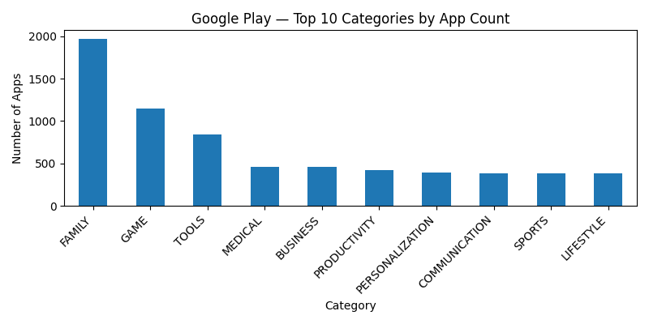</td>
    <td>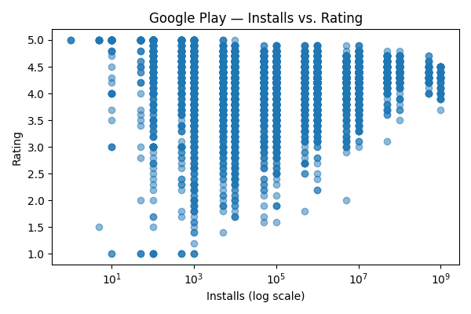</td>
  </tr>
</table>

### Video Game Sales Analysis
<table>
  <tr>
    <td align="center"><strong>Top 10 Games by Global Sales</strong></td>
    <td align="center"><strong>Total Global Sales by Year</strong></td>
  </tr>
  <tr>
    <td>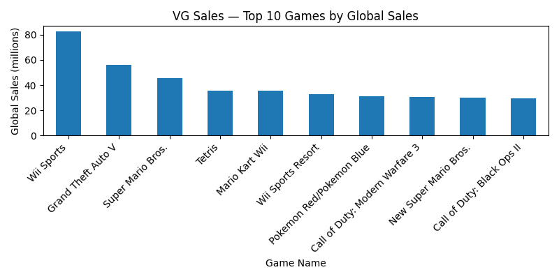</td>
    <td>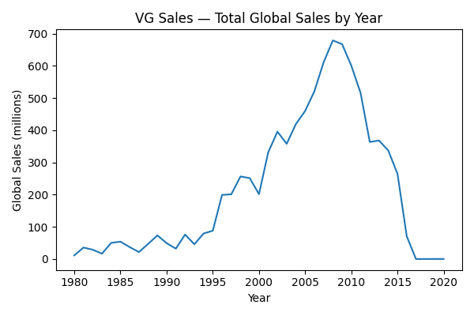</td>
  </tr>
</table>

### Amazon Product Analysis
<table>
  <tr>
    <td align="center"><strong>Top 10 Categories by Avg Rating</strong></td>
    <td align="center"><strong>Discount Percentage Distribution</strong></td>
  </tr>
  <tr>
    <td>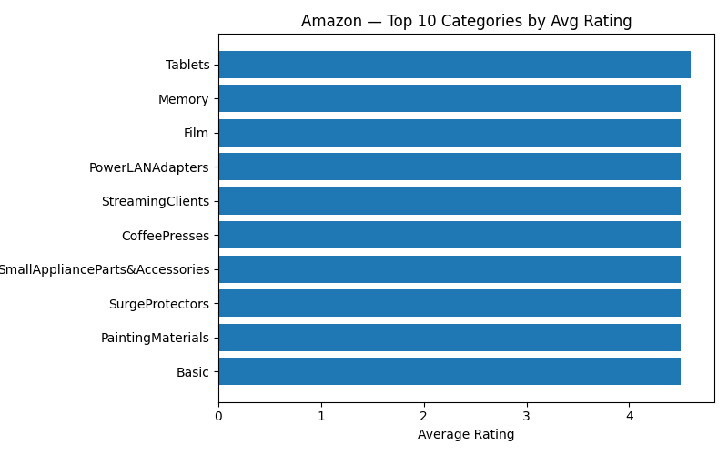</td>
    <td>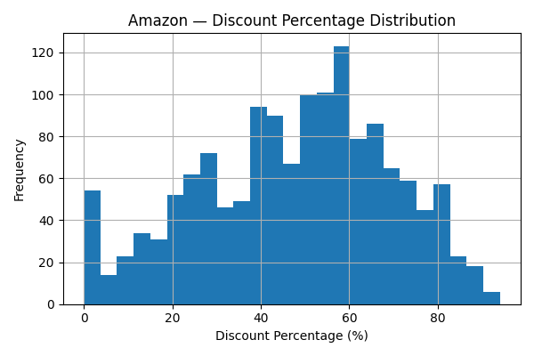</td>
  </tr>
</table>

---

## 🚀 Getting Started

Follow these instructions to get the MongoDB cluster up and running on your local machine.

### Prerequisites

- [Docker](https://www.docker.com/get-started)
- [Docker Compose](https://docs.docker.com/compose/install/)

### Installation & Setup

1.  **Clone the repository** (or ensure you are in the project's root directory).

2.  **Navigate to the functional solution directory:**
    ```sh
    cd "Funkční řešení"
    ```

3.  **Build and start the cluster:**
    ```sh
    docker compose up -d
    ```
    This command will build and start all the necessary containers in detached mode. The initialization process will begin automatically. Docker Compose ensures services start in the correct order.

4.  **Monitor the initialization:**
    You can watch the logs of the initialization containers to see the progress.
    ```sh
    # Watch the cluster setup (replica sets, users, sharding)
    docker logs -f init-cluster

    # Watch the data import process
    docker logs -f init-data
    ```
    The entire process can take several minutes, depending on your machine's performance. Once the `init-data` container finishes, the cluster is ready.

## 💻 Usage

### Connecting to the Cluster

The easiest way to interact with the database is by using the provided `cli` service, which is pre-configured to connect with `readPreference=secondaryPreferred` to balance read loads.

1.  **Run the `mongosh` client in a temporary container:**
    ```sh
    docker compose run --rm cli
    ```
2.  This command starts an interactive `mongosh` shell connected to the `mongos` router instance. From here, you can run any MongoDB command. For example, to see the sharding status:
    ```javascript
    sh.status()
    ```
    Or to see the collections in the `Ecommerce` database:
    ```javascript
    use Ecommerce
    show collections
    ```

### Cluster Initialization Flow
The `init_cluster.sh` script orchestrates the entire setup process:
1.  **Initializes Replica Sets:** It configures each shard (`rs-shard-01`, `rs-shard-02`, `rs-shard-03`) and the config server replica set (`rs-config-server`).
2.  **Waits for Nodes:** It uses the `wait-for-it.sh` script to ensure all nodes are ready before proceeding.
3.  **Configures Router:** It adds all the shards to the `mongos` router.
4.  **Enables Sharding:** It enables sharding on the `Ecommerce` database and shards each collection (`amazon`, `googleplaystore`, `reviews`, `vgsales`) with the appropriate sharding key (Hashed or Ranged).
5.  **Applies Tag-Aware Sharding:** It assigns tags to shards and defines ranges for the `vgsales` collection to ensure data locality.
6.  **Imports Data:** Finally, it runs the `import_datasets.sh` script to populate the collections from the CSV files.

---

## 🔬 Cluster Verification

The following screenshots from the cluster's operational state serve as proof that the replication and sharding strategies have been successfully implemented.

<details>
<summary><strong>Replica Set Status (Example: rs-shard-01)</strong></summary>
<p>The output of <code>rs.status()</code> on the <code>rs-shard-01</code> replica set shows one <strong>PRIMARY</strong> node and two <strong>SECONDARY</strong> nodes, confirming that the 3-member replica set is healthy and operational. The secondaries are actively syncing from the primary.</p>
<p align="center">
  <strong>Primary Node (shard01-a)</strong><br>
  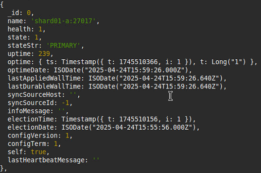
</p>
<p align="center">
  <strong>Secondary Nodes (shard01-b & shard01-c)</strong><br>
  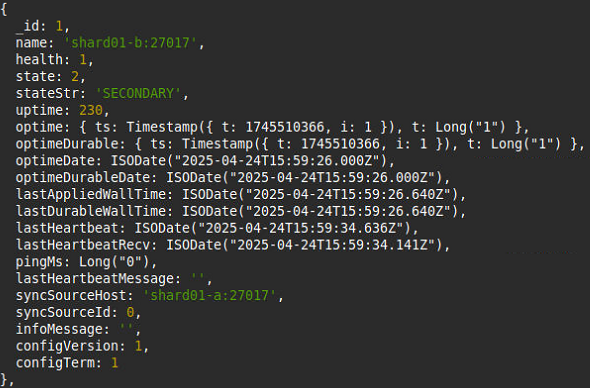
  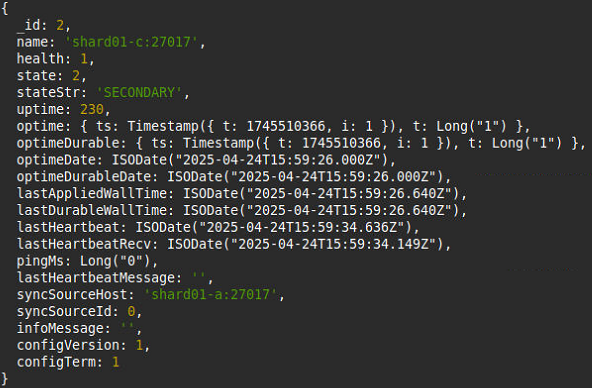
</p>
</details>

<details>
<summary><strong>Sharding Status (sh.status())</strong></summary>
<p>The output of <code>sh.status()</code> confirms that sharding is enabled for the database and collections. It shows the distribution of data chunks across the three shards, demonstrating both <strong>Hashed Sharding</strong> and <strong>Ranged Sharding</strong>.</p>
<p align="center">
  <strong>Sharding Metadata (Amazon & Google Play Store)</strong><br>
  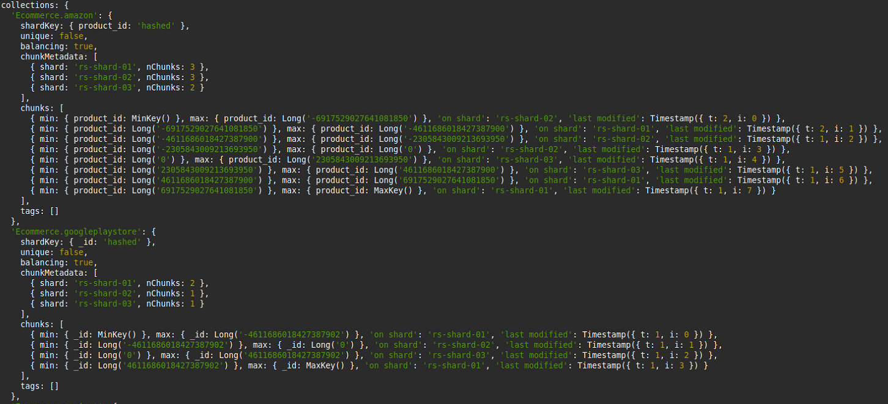
</p>
<p align="center">
  <strong>Sharding Metadata (Reviews & VG Sales)</strong><br>
  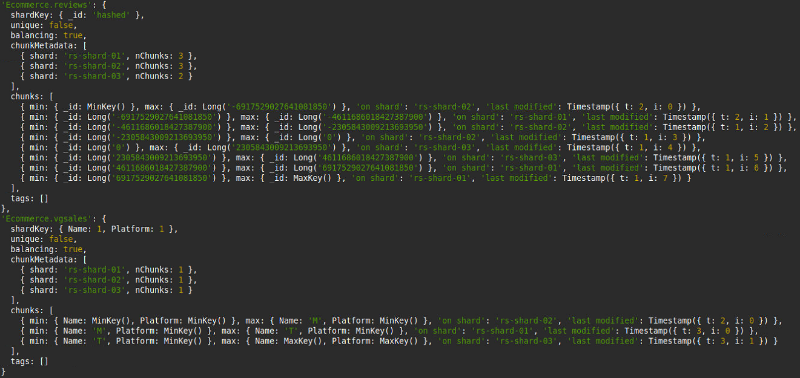
</p>
</details>

---

## 💡 Advanced MongoDB Queries Showcase

This section highlights one representative query from each of the five major categories to demonstrate the project's data processing capabilities.

<details>
<summary><strong>1. Data Manipulation: Update with Aggregation Pipeline</strong></summary>

This query demonstrates a powerful feature where an aggregation pipeline is used directly within an `updateMany` operation. It targets highly-rated electronics, increases their price by 10%, and conditionally adjusts the discounted price based on the existing discount percentage. Finally, it calculates and adds a new field `discountIncrease` to show the new price difference. This avoids the need to read data into an application, modify it, and write it back.

```javascript
db.amazon.updateMany(
  { category: /^Electronics\|/, rating: { $gte: 4.0 } },
  [
    { $set: {
        price_before_discount: {
          $round: [{ $multiply: ["$price_before_discount", 1.10] }, 2]
        },
        price_after_discount: {
          $round: [
            { $multiply: [
                "$price_after_discount",
                { $cond: [{ $gte: ["$discount_percentage", 20] }, 1.05, 1.0] }
            ] },
            2
          ]
        }
      }
    },
    { $addFields: {
        discountIncrease: {
          $round: [
            { $subtract: ["$price_before_discount", "$price_after_discount"] },
            2
          ]
        }
      }
    }
  ]
);
```
</details>

<details>
<summary><strong>2. Aggregation Framework: Calculate Shannon Entropy</strong></summary>

This complex aggregation pipeline calculates the **Shannon entropy** for the distribution of sentiments (Positive/Neutral/Negative) for each app. Entropy is a measure of unpredictability or information content. In this context, a high entropy score means that the reviews for an app are very mixed and polarized (e.g., an equal number of positive, neutral, and negative reviews), while a low score indicates a strong consensus in one direction. This is a sophisticated analytical query performed entirely within the database.

```javascript
db.reviews.aggregate([
  { $group:   { _id:{ app:"$App", sentiment:"$Sentiment" }, count:{ $sum:1 } } },
  { $group:   { _id:"$_id.app",
                counts:{ $push:{ k:"$_id.sentiment", v:"$count" } },
                total:{ $sum:"$count" } } },
  { $addFields:{ distArray:{
                  $map:{ input:"$counts", as:"c",
                         in:{ k:"$$c.k", p:{ $divide:["$$c.v","$total"] } } } }
                } },
  { $unwind:  "$distArray" },
  { $addFields:{ term:{
                  $multiply:[ -1,
                    { $multiply:["$distArray.p",{ $ln:"$distArray.p" }] }
                  ]
                } } },
  { $group:   { _id:"$_id", entropy:{ $sum:"$term" } } },
  { $sort:    { entropy:-1 } },
  { $limit:   5 },
  { $project: { _id:0, app:"$_id", entropy:1 } }
])
```
</details>

<details>
<summary><strong>3. Indexing: Partial Compound Index for Optimization</strong></summary>

This example showcases a **partial index**, a powerful optimization technique. The index `CategoryHighRatingIdx` only includes documents that have a `rating` of 4.5 or higher. This makes the index significantly smaller and more efficient for queries that specifically target high-rated products. The subsequent `find` query is then forced to use this specialized index with `.hint()`, resulting in a much faster query execution because MongoDB doesn't have to scan irrelevant, lower-rated items.

```javascript
// Create Partial Index
db.amazon.createIndex(
  { category: 1, rating: -1 },
  {
    name: "CategoryHighRatingIdx",
    partialFilterExpression: { rating: { $gte: 4.5 }, category: { $exists: true } }
  }
);

// Use Partial Index
db.amazon.find(
  { rating: { $gte: 4.5 }, category: /^Electronics\|/ },
  { category: 1, rating: 1, product_name: 1, _id: 0 }
).sort({ rating: -1 }).hint("CategoryHighRatingIdx").limit(10);
```
</details>

<details>
<summary><strong>4. Sharding: Configure Tag-Aware Sharding</strong></summary>

This set of commands demonstrates **Tag-Aware Sharding** (also known as "Zones"). This advanced sharding feature allows for pinning specific ranges of data to specific shards. Here, we tag each of our three shards with an alphabetic range. Then, we define corresponding ranges on the `vgsales` collection's shard key (`Name`). This configuration guarantees that all video games with names starting from 'A' to 'M' will reside on `rs-shard-01`, 'N' to 'S' on `rs-shard-02`, and so on. This is extremely useful for data locality and can optimize query performance by routing them to the exact shard where the data lives.

```javascript
// 1. Assign tags to shards
sh.addShardTag("rs-shard-01", "A-M");
sh.addShardTag("rs-shard-02", "N-S");
sh.addShardTag("rs-shard-03", "T-Z");

// 2. Assign tag ranges to the collection's shard key
sh.addTagRange(
  "Ecommerce.vgsales",
  { Name: MinKey(), Platform: MinKey() },
  { Name: "M", Platform: MaxKey() },
  "A-M"
);
sh.addTagRange(
  "Ecommerce.vgsales",
  { Name: "N", Platform: MinKey() },
  { Name: "S", Platform: MaxKey() },
  "N-S"
);
sh.addTagRange(
  "Ecommerce.vgsales",
  { Name: "T", Platform: MinKey() },
  { Name: MaxKey(), Platform: MaxKey() },
  "T-Z"
);
```
</details>

<details>
<summary><strong>5. Nested Documents: Find Top 3 Longest Reviews per App</strong></summary>

This query operates on the `apps_meta` collection, which has reviews embedded as an array. It showcases the `$sortArray` operator (new in MongoDB 5.2) to sort the embedded `reviews` array for each document based on the length of the review text. After sorting, it uses `$slice` to take only the top 3 longest reviews. This is a powerful example of performing complex array manipulations directly within the database on embedded documents.

```javascript
db.apps_meta.aggregate([
  { $match: { "reviews.0": { $exists: true } } },
  {
    $addFields: {
      sortedByLength: {
        $sortArray: {
          input: {
            $map: {
              input: "$reviews", as: "r",
              in: { review: "$$r", length: { $strLenCP: "$$r.Translated_Review" } }
            }
          },
          sortBy: { length: -1 }
        }
      }
    }
  },
  {
    $project: {
      _id: 0, appName: 1,
      top3LongestReviews: {
        $map: {
          input: { $slice: ["$sortedByLength", 3] }, as: "item",
          in: "$$item.review"
        }
      }
    }
  }
]);
```
</details>

---

## 📁 Project Structure

```
.
├── Data/
│   ├── amazon.csv
│   ├── googleplaystore.csv
│   ├── googleplaystore_user_reviews.csv
│   ├── vgsales.csv
│   └── analyse_data.py
├── Dotazy/
│   └── dotazyMongoDB.txt
└── Funkční řešení/
    ├── docker-compose.yml
    ├── keyfile/
    │   ├── Dockerfile
    │   └── mongodb-keyfile
    └── scripts/
        ├── auth.js
        ├── import_datasets.sh
        ├── init_cluster.sh
        ├── init-configserver.js
        ├── init-router.js
        ├── init-shard01.js
        ├── init-shard02.js
        ├── init-shard03.js
        └── wait-for-it.sh
```

---

## 🤝 Contributing

Contributions are what make the open-source community such an amazing place to learn, inspire, and create. Any contributions you make are **greatly appreciated**.

If you have a suggestion that would make this better, please fork the repo and create a pull request. You can also simply open an issue with the tag "enhancement".

1.  Fork the Project
2.  Create your Feature Branch (`git checkout -b feature/AmazingFeature`)
3.  Commit your Changes (`git commit -m 'Add some AmazingFeature'`)
4.  Push to the Branch (`git push origin feature/AmazingFeature`)
5.  Open a Pull Request

---

## 📜 License

Distributed under the MIT License. See `LICENSE` for more information.

---

## 🙏 Acknowledgments

-   Datasets sourced from [Kaggle](https://www.kaggle.com/).
-   Badges created with [Shields.io](https://shields.io/).
